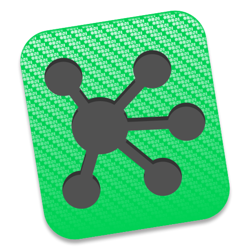
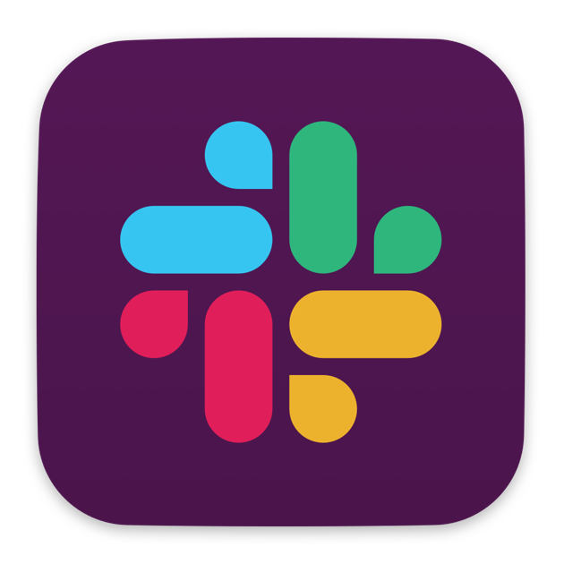
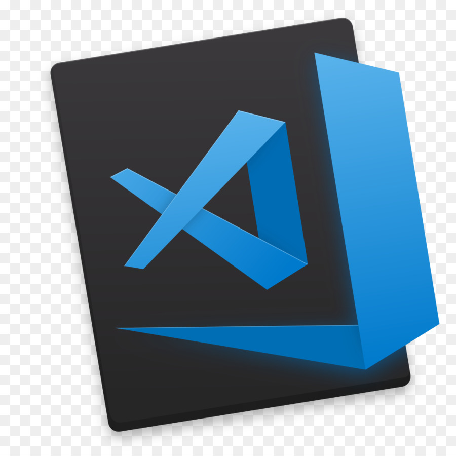

# Mac Install

_Written by: **Nguyen Minh Tam**_

Configures, applications, plug-ins for my personal mac.

## Applications

- [x]  Be Focused

- [x]  Books

- [x]  Caprine

- [x]  Charles
	- [x] [Charles Guide](https://github.com/nmint8m/charlesguide) 

- [x]  Chrome
	> - [x]  Authenticator
	>
	> - [x]  Block Site
	>
	> - [x]  Full Page Screen Capture
	>
	> - [x]  Google Translate

- [x]  Dash

- [x]  Fabric

- [x]  Foxit Reader

- [x]  iMazing

- [x]  Itsycal

- [x]  Keynote

- [x]  KMPlayer

- [x]  MacDown

- [x]  Numbers 

- [x]  OmniGraffle

- [x]  Pages

- [x]  Sequel Pro

- [x]  Sketch

- [x]  Skype

- [x]  Slack

- [x]  Sourcetree

- [x]  Telegram

- [x]  The Unarchiver

- [x]  Visual Studio Code
	> [https://vscodethemes.com/](https://vscodethemes.com/)

- [x]  Xcode

- [x]  Zeplin

## Terminal

###  [Oh my zsh](https://ohmyz.sh/)

- Install: 

```
sh -c "$(curl -fsSL https://raw.github.com/robbyrussell/oh-my-zsh/master/tools/install.sh)"
```

- [Plugins](https://github.com/robbyrussell/oh-my-zsh/wiki/Plugins#bundler):

```
git clone https://github.com/zsh-users/zsh-autosuggestions ${ZSH_CUSTOM:-~/.oh-my-zsh/custom}/plugins/zsh-autosuggestions
```

- [Themes](https://github.com/robbyrussell/oh-my-zsh/wiki/Themes):

- ~/.zshrc file:

```
ZSH_THEME=robbyrussell
plugins=(
  git,
  zsh-autosuggestions
)
source ~/.bashrc
```


###  [Homebrew](https://brew.sh/)

- Requirements:
	- Command Line Tools (CLT) for Xcode: [developer.apple.com/downloads](https://developer.apple.com/downloads) or `Xcode`
	- A Bourne-compatible shell for installation (e.g. bash or zsh)

```
xcode-select --install
```	

- Installation:

```
/usr/bin/ruby -e "$(curl -fsSL https://raw.githubusercontent.com/Homebrew/install/master/install)"
```

### 📦 [Homebrew Bundle](https://github.com/Homebrew/homebrew-bundle)

- Create a Brewfile in the root of your project with:

```
touch Brewfile
```

- Brewfile:

	> https://github.com/sgreben/jp

- Install You can then easily install all of the dependencies with:

```
brew bundle
```

-Exec: Runs an external command within Homebrew's superenv build environment:

```
brew bundle exec -- bundle install
```

### 📦 [rbenv](https://github.com/rbenv/rbenv)

- Install:

```
brew install rbenv
```

- Set up rbenv in your shell:

```
rbenv init
```

- Close your Terminal window and open a new one so your changes take effect.

- Verify that rbenv is properly set up using this rbenv-doctor script:

```
curl -fsSL https://github.com/rbenv/rbenv-installer/raw/master/bin/rbenv-doctor | bash
```

- Basic Github checkout manually:

```
git clone https://github.com/rbenv/rbenv.git ~/.rbenv

touch .bashrc

echo 'export PATH="$HOME/.rbenv/bin:$PATH"' >> ~/.bashrc

echo 'eval "$(rbenv init -)"' >> ~/.bashrc

rbenv init

curl -fsSL https://github.com/rbenv/rbenv-installer/raw/master/bin/rbenv-doctor | bash
``` 

- Usage:

```
rbenv versions

rbenv install -ls

rbenv install 2.5.0

rbenv global 2.5.0
```

###  [Bundler](https://bundler.io/)

Bundler provides a consistent environment for Ruby projects by tracking and installing the exact gems and versions that are needed.

Bundler is an exit from dependency hell, and ensures that the gems you need are present in development, staging, and production. Starting work on a project is as simple as bundle install.

- Init generates a default [Gemfile](https://bundler.io/v2.0/man/gemfile.5.html) in the current working directory:

```
bundle init
```

- Install the gems specified in your [Gemfile](https://bundler.io/v2.0/man/gemfile.5.html):

```
bundle install
```

- Executes the command, making all gems specified in the Gemfile(5) available to require in Ruby programs.

```
bundle exec [--keep-file-descriptors] command
```

### 📦 [swiftenv](https://swiftenv.fuller.li/en/latest/)

- Install:

```
brew install kylef/formulae/swiftenv

echo 'if which swiftenv > /dev/null; then eval "$(swiftenv init -)"; fi' >> ~/.bashrc

echo 'if which swiftenv > /dev/null; then eval "$(swiftenv init -)"; fi' >> ~/.zshrc
```

- Usage:

```
swiftenv versions

swiftenv install --list

swiftenv install 3.0

swiftenv global

swiftenv global 3.0

swiftenv version

swiftenv local 3.0
```